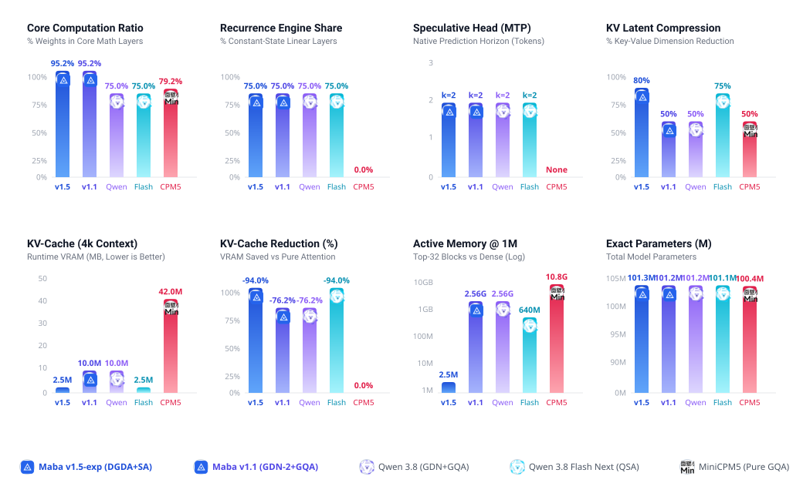

---
language:
- en
license: mit
library_name: transformers
tags:
- maba
- maba-v1.5
- maba-v1.5-exp
- architecture
- recurrent
- decoupled-gated-delta-attention
- dgda
- linear-attention
- linear-recurrence
- sparse-attention
- maba-sa
- mla
- multi-head-latent-attention
- nope
- dg-indexer
- centroid-indexing
- hca
- 3-stream
- swiglu
- rmsnorm
- speculative-decoding
- mtp
- multi-token-prediction
- scaling
- 100m
- 1b
- 3b
- 7b
- 30b
- pytorch
---

<p align="center">
  
</p>

# Maba v1.5-exp Architecture

Reference PyTorch implementation and specifications for the **Maba v1.5 Experimental Architecture** (`maba-v1.5-exp-architecture`).

Maba v1.5 is an interleaved sub-quadratic hybrid model combining:
* **75% Decoupled Gated Delta Attention (DGDA)**: Linear recurrence with independent key erase gate `b_t`, value write gate `w_t`, channel-wise negative-softplus decay `alpha_t`, and chunkwise parallel prefill (C=16) via Order-3 Neumann series inversion.
* **25% Global MABA-SA Attention**: Low-rank MLA key-value compression (d_c=128), strict NoPE (no positional embeddings), Delta-Guided Centroid Indexing (Top-32 blocks), and 3-stream output superposition (Local window + Top-32 sparse blocks + 64:1 HCA).
* **High Computation Core (95.21%)**: Factorized token embeddings (32,768 -> 128 -> 640) constrain vocabulary tax to 4.30%, leaving 95.21% of parameters for sequence modeling layers.
* **Native Speculative Drafter**: Built-in Multi-Token Prediction (MTP k=2) heads for parallel token verification without companion models.

---

## Documentation Index

Detailed technical documentation is organized across dedicated files:
* [SCALING.md](SCALING.md): Multi-scale parameter derivations from 100M to 30B, KV cache scaling to 1M context, and audits against 2026 foundation architectures (Qwen3.5, Muse-30B, Gemma4).
* [BENCHMARK_REPORT.md](BENCHMARK_REPORT.md): Empirical test verification, state memory invariance, and runtime scaling benchmarks.
* [MABA_SPARSE_SPEC_AND_ROADMAP.md](MABA_SPARSE_SPEC_AND_ROADMAP.md): Full mathematical derivations, proofs, gate mechanics, and algorithm pseudo-code.

---

<p align="center">
  
</p>

---

## 6-Way Macro Architecture Comparison (~101M Parameters)

| Metric | Maba v1.5-exp | Maba v1.1 | Maba v1.0 Legacy | Qwen 3.8 | Qwen 3.8 Flash Next | MiniCPM5 |
| :--- | :--- | :--- | :--- | :--- | :--- | :--- |
| **Parameter Budget** | **101.28M** | 101.18M | 101.18M | 101.15M | 101.13M | 100.40M |
| **Core Computation Ratio** | **95.21%** | 95.21% | 95.21% | 75.00% | 74.99% | 79.20% |
| **Recurrence Engine (75%)** | **DGDA (Decoupled)** | GDN-2 (Tied Gate) | GDN (Standard) | GDN (Standard) | GDN (Standard) | 0% (Pure Attention) |
| **Chunk Inversion** | **Neumann-3 + Fallback** | Sequential | Sequential | Sequential | Sequential | N/A |
| **Attention Engine (25%)** | **MABA-SA (MLA+Top32+HCA)**| GQA (4:1) | GQA (4:1) | GQA (4:1) | QSA (Sparse) | 100% GQA |
| **Positional Encoding** | **Strict NoPE** | RoPE | RoPE | RoPE | RoPE | RoPE |
| **KV Cache Footprint (4k)** | **2.50 MB (-94.0%)** | 10.00 MB (-76.2%) | 10.00 MB (-76.2%) | 10.00 MB (-76.2%) | 2.50 MB (-94.0%) | 42.00 MB (Baseline) |
| **Recurrent State (O(1))** | **2.45 MB** | 1.17 MB | 1.17 MB | 1.17 MB | 1.17 MB | 0.00 MB |
| **Active Memory @ 1M Context**| **2.50 MB (-99.97%)** | 2,560.00 MB | 2,560.00 MB | 2,560.00 MB | 640.00 MB | 10,752.00 MB |
| **Speculative Heads** | **Built-in MTP (k=2)** | Built-in MTP (k=2) | None | Built-in MTP (k=2) | Built-in MTP (k=2) | None |
| **Test Suite Verification** | **152 / 152 passed (100%)** | 105 passed | 82 passed | N/A | N/A | N/A |

> [!NOTE]
> **Pretrained Weights and Downstream Evaluation**
> This repository contains the reference architectural specification and PyTorch engine. Downstream task evaluations (ARC-Easy, HellaSwag, Story Cloze) and trained Safetensors weights will be published in the dedicated model weights repository upon completing pretraining runs.

---

## Exact Parameter & Memory Breakdown (101M Reference Model)

### 1. Parameter Accounting

| Component | Sub-Layers | Exact Parameters | % of Total | Function |
| :--- | :--- | :---: | :---: | :--- |
| **Factorized Embedding** | W_emb (32,768 x 128) | 4,194,304 | 4.14% | Token lookup table |
| **Embedding Projections** | W_proj_in + W_proj_out | 163,840 | 0.16% | Rank 128 <-> Dim 640 |
| **Embedding Subtotal** | **Vocab Tax** | **4,358,144** | **4.30%** | **Static parameter overhead** |
| **15 DGDA Recurrence Blocks** | DGDA Mixer + SwiGLU FFN + RMSNorm | 74,908,800 | 73.96% | Linear O(1) recurrence & gating |
| **5 MABA-SA Attention Blocks** | MLA Attention + DG-Indexer + SwiGLU | 21,522,560 | 21.25% | Dynamic sparse attention routing |
| **Computation Core** | **All 20 Physical Blocks** | **96,431,360** | **95.21%** | **Core sequence modeling** |
| **Final RMSNorm** | Layer normalization gain | 640 | <0.01% | Final feature variance scale |
| **MTP Auxiliary Head** | k=2 projection and norm | 492,160 | 0.49% | Native speculative verification |
| **Total Architecture** | **Full Model Parameters** | **101,282,319** | **100.00%** | **101.28M parameter budget** |

### 2. State Memory Scaling Across Context Horizons

| Context Length (Tokens) | Maba v1.5-exp Cache | Maba v1.1 Cache | Qwen 3.8 Cache | Qwen 3.8 Flash Next | Pure Attention (Dense) | Memory Reduction vs Dense |
| :---: | :---: | :---: | :---: | :---: | :---: | :---: |
| **1,024 (1k)** | **1.25 MB** | 2.50 MB | 2.50 MB | 1.25 MB | 10.50 MB | **-88.1%** |
| **2,048 (2k)** | **1.88 MB** | 5.00 MB | 5.00 MB | 1.88 MB | 21.00 MB | **-91.0%** |
| **4,096 (4k)** | **2.50 MB** | 10.00 MB | 10.00 MB | 2.50 MB | 42.00 MB | **-94.0%** |
| **8,192 (8k)** | **5.00 MB** | 20.00 MB | 20.00 MB | 5.00 MB | 84.00 MB | **-94.0%** |
| **16,384 (16k)** | **10.00 MB** | 40.00 MB | 40.00 MB | 10.00 MB | 168.00 MB | **-94.0%** |
| **32,768 (32k)** | **20.00 MB** | 80.00 MB | 80.00 MB | 20.00 MB | 336.00 MB | **-94.0%** |
| **65,536 (64k)** | **40.00 MB** | 160.00 MB | 160.00 MB | 40.00 MB | 672.00 MB | **-94.0%** |
| **131,072 (128k)** | **80.00 MB** | 320.00 MB | 320.00 MB | 80.00 MB | 1,344.00 MB | **-94.0%** |
| **1,048,576 (1M)** | **2.50 MB\*** | 2,560.00 MB | 2,560.00 MB | 640.00 MB | 10,752.00 MB | **-99.97%** |

\* Note on 1M Context: The DG-Indexer selects Top-32 blocks (2048 active tokens), bounding working attention memory at 2.50 MB regardless of sequence length.

---

## Core Formulation Reference

Clean mathematical representations without complex LaTeX macros:

```text
1. Recurrence Step (DGDA, 75% of layers):
   State Update : S_t = diag(alpha_t) * S_{t-1} - k_t * ((b_t * k_t)^T * diag(alpha_t) * S_{t-1}) + (w_t * v_t) * k_t^T
   Readout      : o_t = q_t * S_t
   Where        : b_t in [0, 1]^d_k (erase gate), w_t in [0, 1]^d_v (write gate)
                  alpha_t = exp(-softplus(x_t * W_alpha)) (channel-wise decay)

2. Dynamic Sparse Attention (MABA-SA, 25% of layers):
   KV Latent    : c_t = W_down * x_t  (compressed from dim 640 to rank 128)
   Centroids    : C_i = 0.5 * mean(Block_i) + 0.5 * max(Block_i)
   Block Score  : Score(q_t, C_i) = q_t * C_i^T - lambda * log(1 + |t/B - i|)
   Routing      : Dynamically queries the Top-32 most salient blocks of size B=64

3. 3-Stream Output Superposition:
   O_t = g_local * O_local + g_sparse * O_sparse + g_hca * O_hca
   Where {g_local, g_sparse, g_hca} = softmax(x_t * W_gate)
   - Stream 1: Local window W=128 + 4 attention sinks
   - Stream 2: Dynamic Top-32 sparse blocks
   - Stream 3: 64:1 macro-averaged compressed history (HCA)
```

---

## Verification Test Suite (100% Pass Rate)

The test suite verifies numerical stability, boundary sequence lengths, causal masking, and O(1) state memory invariance:

```bash
pytest -q
```
```text
........................................................................ [ 47%]
........................................................................ [ 94%]
........                                                                 [100%]
152 passed in 24.13s
```

All 8 test suites pass with zero warnings:
* [tests/test_dgda.py](tests/test_dgda.py): Chunkwise Neumann prefill parity against recurrent decode (error < 4.58e-5).
* [tests/test_dgda_stress.py](tests/test_dgda_stress.py): Arbitrary sequence lengths (1, 17, 33, 65, 128, 256) and extreme inputs (+-100).
* [tests/test_indexer.py](tests/test_indexer.py): Hybrid centroid pooling, distance penalties, and causal block masking.
* [tests/test_sparse_attention.py](tests/test_sparse_attention.py): MLA compression, 3-stream superposition, and KV cache updates.
* [tests/test_model.py](tests/test_model.py): 101M parameter accounting, tied embeddings, MTP auxiliary loss, and generation.
* [tests/test_nope_order_sensitivity.py](tests/test_nope_order_sensitivity.py): Permutation sensitivity under zero RoPE (L2 divergence = 39.518).
* [tests/test_challenger_empirical.py](tests/test_challenger_empirical.py): Strict O(1) state memory invariance (exactly 2,457,600 bytes).
* [tests/test_ablations.py](tests/test_ablations.py): Layer ablations (pure DGDA, no HCA, dense transformer baseline).

---

## Quick Start & Reference API

### 1. Installation
```bash
git clone https://huggingface.co/AndrewThompson1233/maba-v1.5-exp-architecture
cd maba-v1.5-exp-architecture
pip install -e .
```

### 2. Autoregressive Generation
```python
import torch
from maba_sparse.config import MabaSparseConfig
from maba_sparse.model import MabaSparseForCausalLM, get_101m_config

# Initialize 101M reference model
cfg = get_101m_config()
model = MabaSparseForCausalLM(cfg)

# Autoregressive generation
prompt = torch.tensor([[101, 2045, 312]])
generated = model.generate(prompt, max_new_tokens=32, temperature=0.7)
print("Generated token sequence:", generated.tolist())
```

### 3. Training & Benchmarking
```bash
# Model training smoke test
python train.py --model maba_sparse --steps 5 --batch_size 2 --seq_len 64

# Benchmark latency and state memory scaling
python benchmark.py --contexts 512,1024,2048,4096 --warmup 1 --repeats 2
```
