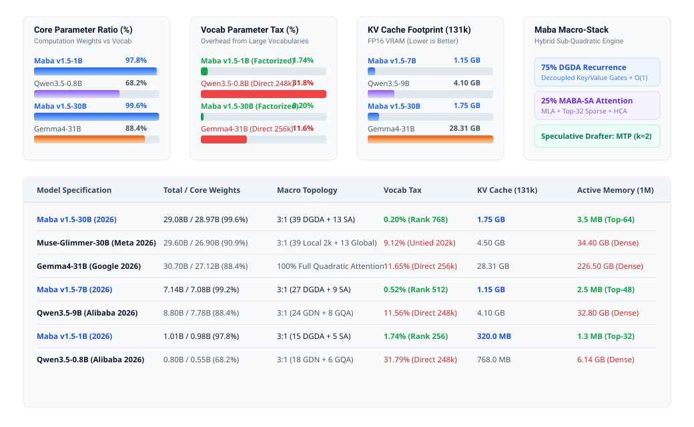

# Maba v1.5-exp Architecture: Scaling and 2026 Frontier Architectural Comparison

Technical specification, closed-form parameter formulations, and architectural audit for scaling the **Maba v1.5-exp** architecture from 100M to 1B, 3B, 7B, and 30B parameters against 2026 frontier and edge architectures (Qwen3.5, Muse-Glimmer-30B, Gemma4, MiniCPM5).

---

  

---

## 1. Scaling Topology Presets (100M to 30B)

| Parameter / Architectural Metric | Maba-100M | Maba-1B | Maba-3B | Maba-7B | Maba-30B |
| :--- | :--- | :--- | :--- | :--- | :--- |
| **Total Parameters** | 101,282,319 (101.3M) | 1,006,242,816 (1.01B) | 2,981,578,752 (2.98B) | 7,138,421,760 (7.14B) | 29,082,419,200 (29.08B) |
| **Core Computation Parameters** | 96,431,360 (95.21%) | 984,020,480 (97.79%) | 2,945,723,392 (98.80%) | 7,082,446,848 (99.22%) | 28,973,420,544 (99.63%) |
| **Factorized Embedding Parameters** | 4,358,144 (4.30%) | 17,498,112 (1.74%) | 26,836,992 (0.90%) | 37,093,376 (0.52%) | 59,572,224 (0.20%) |
| **Vocab Tax (% of Total Parameters)**| **4.30%** | **1.74%** | **0.90%** | **0.52%** | **0.20%** |
| **Vocabulary Size (V)** | 32,768 | 64,256 | 64,256 | 64,256 | 64,256 |
| **Embedding Rank (d_emb)** | 128 | 256 | 384 | 512 | 768 |
| **Hidden Dimension (dim / D)** | 640 | 2048 | 2816 | 4096 | 6656 |
| **Physical Blocks (N_blocks)** | 20 | 20 | 32 | 36 | 52 |
| **Block Ratio (DGDA : MABA-SA)** | 3:1 (15 DGDA : 5 SA) | 3:1 (15 DGDA : 5 SA) | 3:1 (24 DGDA : 8 SA) | 3:1 (27 DGDA : 9 SA) | 3:1 (39 DGDA : 13 SA) |
| **Query Heads (n_heads)** | 10 | 16 | 22 | 32 | 52 |
| **Head Dimension (d_head = d_k = d_v)**| 64 | 128 | 128 | 128 | 128 |
| **MLA KV Latent Dimension (d_c)** | 128 | 256 | 384 | 512 | 768 |
| **Centroid Index Dimension (d_idx)** | 64 | 128 | 128 | 128 | 256 |
| **Centroid Block Size (B)** | 64 | 64 | 64 | 64 | 64 |
| **Top-K Block Selection** | 32 blocks | 32 blocks | 32 blocks | 48 blocks | 64 blocks |
| **Local Sliding Window (W)** | 128 | 256 | 256 | 512 | 512 |
| **HCA Macro-Pooling Ratio** | 64:1 | 64:1 | 64:1 | 64:1 | 64:1 |
| **FFN Dimension (intermediate_size)** | 1728 (~8/3 D) | 5504 (~8/3 D) | 7488 (~8/3 D) | 11008 (~8/3 D) | 19968 (~8/3 D) |
| **Causal Conv Kernel (kernel_size)** | 4 | 4 | 4 | 4 | 4 |
| **DGDA Parallel Chunk Size (C)** | 16 | 16 | 16 | 16 | 16 |
| **Target Context Length (Tokens)** | 4,096 | 16,384 | 32,768 | 131,072 | 1,048,576 |
| **Speculative Decoding Horizon** | Built-in MTP (k=2) | Built-in MTP (k=2) | Built-in MTP (k=2) | Built-in MTP (k=2) | Built-in MTP (k=2) |

---

## 2. Comparison Against 2026 Frontier Architectures

### 1B - 3B Tier (Edge & Compact LLMs)

| Architectural Attribute | Maba v1.5-1B (2026) | Qwen3.5-0.8B (2026) | Qwen3.5-2B (2026) | Maba v1.5-3B (2026) | Qwen3.5-4B (2026) | MiniCPM5-2B (2026) |
| :--- | :--- | :--- | :--- | :--- | :--- | :--- |
| **Backbone Architecture** | DGDA + MABA-SA (3:1) | GDN + Attention (3:1) | GDN + Attention (3:1) | DGDA + MABA-SA (3:1) | GDN + Attention (3:1) | Pure Attention GQA |
| **Total Parameters** | **1,006.2M (1.01B)** | 800.0M (0.80B) | 2,000.0M (2.00B) | **2,981.6M (2.98B)** | 4,000.0M (4.00B) | 2,200.0M (2.20B) |
| **Core Computation Share** | **97.79%** | 68.21% | 74.57% | **98.80%** | 84.11% | 81.20% |
| **Vocab Tax** | **1.74% (Rank 256)** | 31.79% (Direct) | 25.43% (Direct) | **0.90% (Rank 384)** | 15.89% (Direct) | 18.80% (Direct) |
| **Attention Layers** | 5 layers (25%) | 6 layers (25%) | 6 layers (25%) | 8 layers (25%) | 8 layers (25%) | 28 layers (100%) |
| **Attention Mechanism** | **MLA + Top-32 Sparse + HCA** | Dense GQA | Dense GQA | **MLA + Top-32 Sparse + HCA** | Dense GQA | Dense GQA |
| **Positional Encoding** | **Strict NoPE** | RoPE | RoPE | **Strict NoPE** | RoPE | RoPE |
| **KV Cache Footprint (131k FP16)**| **320.0 MB (-75.0%)** | 768.0 MB | 1,536.0 MB | **512.0 MB (-87.5%)** | 4,096.0 MB | 5,376.0 MB |
| **Speculative Drafter** | Built-in MTP (k=2) | Built-in MTP | Built-in MTP | Built-in MTP (k=2) | Built-in MTP | External drafter |

### 7B - 9B Tier (Standard Enterprise & Research Scale)

| Architectural Attribute | Maba v1.5-7B (2026) | Qwen3.5-9B (2026) | Qwen3-8B (2026) | IFM/K2-Horizon-7B (2026) |
| :--- | :--- | :--- | :--- | :--- |
| **Backbone Architecture** | DGDA + MABA-SA (3:1) | GDN + GQA Hybrid (3:1) | Dense Transformer | Dense Transformer |
| **Total Parameters** | **7,138.4M (7.14B)** | 8,800.0M (8.80B) | 8,280.4M (8.28B) | 7,974.7M (7.97B) |
| **Core Computation Share** | **99.22%** | 88.44% | 84.97% | 87.13% |
| **Vocab Tax** | **0.52% (Rank 512)** | 11.56% (248k Vocab) | 15.03% (Untied 152k) | 12.87% (Tied 250k) |
| **Attention Layers With Linear Growth** | **9 layers (25%)** | 8 layers (25%) | 36 layers (100%) | 36 layers (100%) |
| **KV Cache Compression** | **Low-rank MLA ($d_c=512$) + Top-48** | GQA (4:1) | Full KV | Full KV |
| **KV Cache Footprint (131k FP16)**| **1,152.0 MB (1.15 GB)** | 4,096.0 MB (4.10 GB) | 19,327.4 MB (19.33 GB) | 18,432.0 MB (18.43 GB) |
| **Memory Reduction vs Dense** | **-94.0%** | -78.8% | 0.0% (Baseline) | -4.6% |
| **Speculative Decoding** | **Built-in MTP (k=2, 0 MB overhead)**| Built-in MTP | None | None |

### 30B Tier (Frontier Large-Scale Pretraining)

| Architectural Attribute | Maba v1.5-30B (2026) | Muse-Glimmer-30B (Meta 2026) | Qwen3.8-27B (2026) | Gemma4-31B (Google 2026) |
| :--- | :--- | :--- | :--- | :--- |
| **Backbone Architecture** | DGDA Recurrence + MABA-SA | Dense Transformer + Local Window | Linear Attention + Full Attention | Dense Transformer |
| **Total Parameters** | **29.08B** | 29.60B (incl. 1.8B ViT-G) | 27.20B | 30.70B |
| **Core Computation Share** | **99.63%** | 90.88% | 90.30% | 88.35% |
| **Vocab Tax** | **0.20% (Rank 768)** | 9.12% (Untied 202k) | 9.70% (Untied 248k) | 11.65% (Direct 256k) |
| **Recurrence Chunking** | **Order-3 Neumann Series ($C=16$)** | None | Sequential step | None |
| **Attention Sparsity** | **Top-64 Block Centroids + HCA** | 2k Local Sliding Window | 25% Full Quadratic Attention | 100% Full Attention |
| **Attention Layers With State Growth** | **13 layers (25%)** | 13 global + 39 local window | 16 layers (25%) | 54 layers (100%) |
| **KV Cache Footprint (131k FP16)**| **1,747.6 MB (1.75 GB)** | 4,504.0 MB (4.50 GB) | 8,589.9 MB (8.59 GB) | 28,311.6 MB (28.31 GB) |
| **KV Cache Footprint (1M FP16)** | **3.50 MB (Active Top-64 Blocks)\*** | 34,400.0 MB (34.4 GB) | 68,719.5 MB (68.7 GB) | 226,492.8 MB (226.5 GB) |
| **Speculative Verification** | **Built-in MTP ($k=2$)** | DFlash block-diffusion companion | MTP auxiliary layer ($k=2$) | External drafter ($k=1$) |

\* Note on 1M Context: Active token selection via Top-64 blocks ($64 \times 64 = 4096$ active tokens) guarantees that the active attention working memory is bounded at 3.50 MB regardless of sequence length.

---

## 3. KV-Cache Memory Scaling Across Sequence Horizons

Memory footprint in megabytes (MB) for single-stream FP16 inference:

$$\text{Maba v1.5 Active Cache} = N_{\text{sa}} \times (\text{Top-}K \times B) \times d_c \times 2 \text{ bytes}$$
$$\text{Maba v1.5 Full Latent History} = N_{\text{sa}} \times L \times d_c \times 2 \text{ bytes}$$

| Model Scale | Model | 32,768 Tokens | 65,536 Tokens | 131,072 Tokens | 1,048,576 Tokens (1M) | Memory Reduction vs Dense |
| :--- | :--- | :---: | :---: | :---: | :---: | :---: |
| **30B Tier** | **Maba v1.5-30B (Active)** | **3.5 MB** | **3.5 MB** | **3.5 MB** | **3.5 MB** | **-99.99%** |
| 30B Tier | **Maba v1.5-30B (Full Latent)**| **436.9 MB** | **873.8 MB** | **1,747.6 MB** | **13,980.8 MB (14.0 GB)** | **-93.8%** |
| 30B Tier | Maba v1.1-30B | 873.8 MB | 1,747.6 MB | 3,495.3 MB | 27,962.4 MB | -87.7% |
| 30B Tier | Muse-Glimmer-30B | 1,126.0 MB | 2,252.0 MB | 4,504.0 MB | 36,032.0 MB | -84.1% |
| 30B Tier | Qwen3.8-27B | 2,147.5 MB | 4,295.0 MB | 8,589.9 MB | 68,719.5 MB | -69.7% |
| 30B Tier | Gemma4-31B (Dense) | 7,077.9 MB | 14,155.8 MB | 28,311.6 MB | 226,492.8 MB (226.5 GB) | Baseline |
| **7B Tier** | **Maba v1.5-7B (Active)** | **2.5 MB** | **2.5 MB** | **2.5 MB** | **2.5 MB** | **-99.98%** |
| 7B Tier | **Maba v1.5-7B (Full Latent)** | **288.0 MB** | **576.0 MB** | **1,152.0 MB** | **9,216.0 MB (9.2 GB)** | **-93.8%** |
| 7B Tier | Maba v1.1-7B | 1,152.0 MB | 2,304.0 MB | 4,608.0 MB | 36,864.0 MB | -75.0% |
| 7B Tier | Qwen3-8B (Dense) | 4,831.8 MB | 9,663.7 MB | 19,327.4 MB | 154,619.2 MB (154.6 GB) | Baseline |
| **3B Tier** | **Maba v1.5-3B (Active)** | **1.8 MB** | **1.8 MB** | **1.8 MB** | **1.8 MB** | **-99.97%** |
| 3B Tier | **Maba v1.5-3B (Full Latent)** | **128.0 MB** | **256.0 MB** | **512.0 MB** | **4,096.0 MB (4.1 GB)** | **-94.0%** |
| 3B Tier | Maba v1.1-3B | 512.0 MB | 1,024.0 MB | 2,048.0 MB | 16,384.0 MB | -76.2% |
| 3B Tier | Spark-X2.5-4B (Dense) | 2,880.0 MB | 5,760.0 MB | 11,520.0 MB | 92,160.0 MB (92.2 GB) | Baseline |
| **1B Tier** | **Maba v1.5-1B (Active)** | **1.2 MB** | **1.2 MB** | **1.2 MB** | **1.2 MB** | **-99.95%** |
| 1B Tier | **Maba v1.5-1B (Full Latent)** | **80.0 MB** | **160.0 MB** | **320.0 MB** | **2,560.0 MB (2.6 GB)** | **-94.0%** |
| 1B Tier | Maba v1.1-1B | 320.0 MB | 640.0 MB | 1,280.0 MB | 10,240.0 MB | -76.2% |
| 1B Tier | MiniCPM5-1B (Dense) | 576.0 MB | 1,152.0 MB | 2,304.0 MB | 18,432.0 MB (18.4 GB) | Baseline |

---

## 4. Closed-Form Mathematical Parameter Formulations

The exact parameter counts across all model scales are derived using closed-form formulations:

### 1. Factorized Embedding Weights
$$P_{\text{emb}} = V \cdot d_{\text{emb}} + 2 \cdot d_{\text{emb}} \cdot D$$

### 2. DGDA Recurrence Block Parameters
For each of the $0.75 \times N_{\text{blocks}}$ recurrence layers:
$$P_{\text{dgda\_proj}} = 3 \cdot D \cdot (H \cdot d_k) + 3 \cdot D \cdot (H \cdot d_k) + (H \cdot d_v) \cdot D$$
$$P_{\text{conv}} = 3 \cdot \text{kernel\_size} \cdot D$$
$$P_{\text{norm}} = 2 \cdot D \quad (\text{pre-norm and post-norm RMSNorm})$$
$$P_{\text{ffn}} = 3 \cdot D \cdot d_{\text{ffn}} \quad (\text{SwiGLU gate, up, down})$$
$$P_{\text{res\_gates}} = 2 \cdot D \quad (\text{learnable residual gating})$$
$$P_{\text{dgda\_layer}} = P_{\text{dgda\_proj}} + P_{\text{conv}} + P_{\text{norm}} + P_{\text{ffn}} + P_{\text{res\_gates}}$$

### 3. MABA-SA Dynamic Sparse Attention Block Parameters
For each of the $0.25 \times N_{\text{blocks}}$ attention layers:
$$P_{\text{mla}} = D \cdot (H \cdot d_{\text{head}}) + D \cdot d_c + 2 \cdot d_c \cdot (H \cdot d_{\text{head}}) + (H \cdot d_{\text{head}}) \cdot D$$
$$P_{\text{gate}} = D \cdot 3 + 3$$
$$P_{\text{indexer}} = 2 \cdot D \cdot d_{\text{idx}}$$
$$P_{\text{sa\_layer}} = P_{\text{mla}} + P_{\text{gate}} + P_{\text{indexer}} + P_{\text{norm}} + P_{\text{ffn}} + P_{\text{res\_gates}}$$

### 4. Multi-Token Prediction (MTP k=2) Auxiliary Head
$$P_{\text{mtp}} = D \cdot d_{\text{emb}}$$
Note: LM head weights $W_{\text{lm\_head}} \in \mathbb{R}^{d_{\text{emb}} \times V}$ are tied with the factorized input embedding lookup table $W_{\text{emb}}^\top$, adding zero additional parameter weight.
